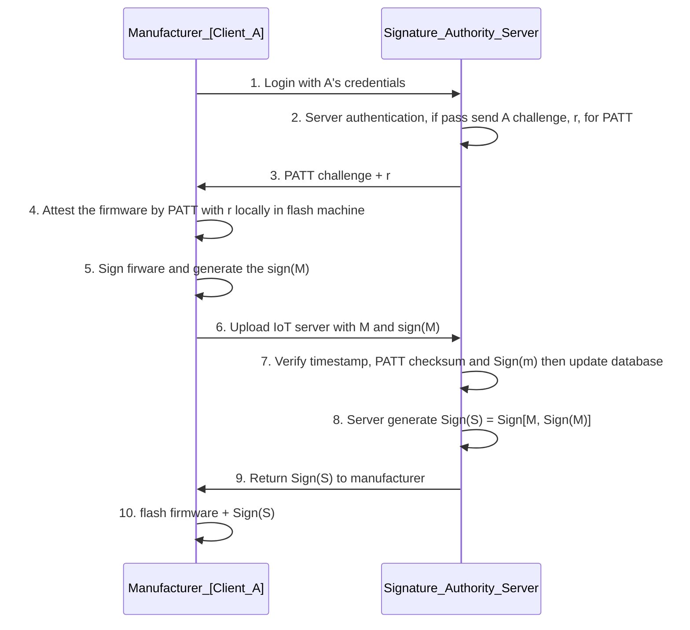
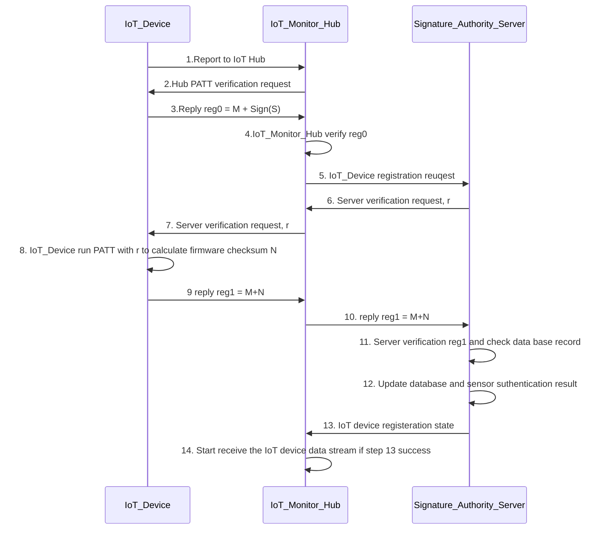

# IoT Supply Chain Protection Case Study : Use Shadow-Box-For-Arm and PATT for Firmware Integrity Assurance

**Project Design Purpose** : This article will introduce a proof-of-concept (POC) case study on securing the IoT firmware supply chain by combining a Trusted Execution Environment (TEE) with physics-based runtime attestation. This experiment demonstrates how to use the [shadow-box-for-arm](https://github.com/kkamagui/shadow-box-for-arm) to establish a lightweight TEE on ARM-based IoT devices, and how integrating the [PATT: Physics-based Attestation of Control Systems](https://repository.sutd.edu.sg/esploro/outputs/conferenceProceeding/PAtt-Physics-based-Attestation-of-Control-Systems/9911651509846) in the IoT firmware to provide continuous firmware integrity assurance.

This article is organized into four key components:

- **IoT Radar Device with PATT Integration** : Introduction of the design of a people-detection IoT radar IoT device and the integration of the PATT algorithm to model and verify the IoT executing firmware. 
- **TEE Deployment Using Shadow-Box-For-Arm** : Implementation of a Trusted Execution Environment to securely isolate sensitive assets of the IoT device, including firmware logic and the PATT attestation mechanism.
- **Secure Firmware Provisioning During Manufacturing** : Design of protection mechanisms during the initial firmware flashing stage to ensure authenticity and prevent unauthorized modification within the supply chain.
- **Runtime IoT Firmware Attestation** : Continuous integrity verification of the deployed firmware using PATT, enabling detection of anomalies or malicious tampering during device operation.

This case study is a Proof of Concept for IOT Supply Chain Protection, in real production environment, the feature will be more complex.

```python
# Author:      Yuancheng Liu
# Created:     2020/06/29
# Version:     v_0.0.2
# Copyright:   Copyright (c) 2020 Liu Yuancheng
# License:     MIT License
```

**Table of Contents**

[TOC]

------

### 1. Introduction 

The Internet of Things (IoT) is smart embedded devices that have the ability to transfer data over a network without requiring human or computer interaction. While IoT technologies enable significant innovation across industries, their highly distributed and multi-stakeholder supply chains introduce substantial security risks. Devices often pass through multiple vendors, manufacturers, and integrators, creating numerous opportunities for adversaries to tamper with hardware or firmware. 

The complexity of the IoT supply chain makes it particularly vulnerable to attacks such as firmware modification, counterfeit component insertion, intellectual property theft, and malicious code injection. A practical example is demonstrated in this [Drone Firmware Attack and Defense Case Study](https://www.linkedin.com/pulse/ot-cyber-attack-workshop-case-study-05-drone-firmware-yuancheng-liu-giogc):

 

Where an attacker replaced legitimate sensor firmware during transit, ultimately causing system malfunction and device failure during operation.

To address these challenges, ensuring firmware integrity across the entire device lifecycle—from manufacturing to deployment and runtime—is critical. This project presents a proof-of-concept (PoC) system designed to protect IoT firmware integrity by combining secure execution and continuous attestation mechanisms.

The goal of this project is to design and validate an end-to-end protection pipeline that safeguards IoT firmware across both manufacturing and operational phases. By combining secure execution with behavior-based attestation, the proposed approach addresses limitations of traditional static verification methods and enhances resilience against supply chain tampering and runtime compromise. 


#### 1.1 Project Overview

A malicious attacker could insert defect or malware, introduce counterfeit, pirate IP, or launch any malicious attack, at any point in the supply chain. Hence, it is importance to protect the malware integrity of the entire supply chain. In this POC we want to protect the firmware's Integrity from the steps in is flashing in the IoT to the time user start to use it. The system technology stack overview is shown blow: 

- In this project I use the Xandar_People_Detection_Radar(Sensor) and a Raspberry PI to build a reconfigurable IoT device with multiple firmware files. 
- For real time firmware execution attestation, I use the algorithm introduced in paper [PATT: Physics-based Attestation of Control Systems](https://repository.sutd.edu.sg/esploro/outputs/conferenceProceeding/PAtt-Physics-based-Attestation-of-Control-Systems/9911651509846) . 
- For protecting the PATT information and code, I use the [shadow-box-for-arm](https://github.com/kkamagui/shadow-box-for-arm) to build the Arm Trusted Execution Environment
- For Firmware flashing attestation, I create a firmware signal clint running in the manufacturer side and one signature authority server running in the IoT service provider side. 
- For Firmware integrity assurance verification, I create a IoT verification server running in the IoT service provider side to receive the IoT's attestation PATT request connect to the signature authority server to do the IoT authentication.  

#### 1.2 System Work Flow 

**1.2.1 Firmware flashing attestation workflow** 

The Firmware flashing attestation work flow is shown in the below diagram: 



```
Update message : M = ID + version + sensor type + flashing timestamp
Signature : Sign(M) = M + MD5(firmware)
```

**1.2.1 IoT device real time attestation** 

The IoT device real time attestation is  shown in the below diagram: 



