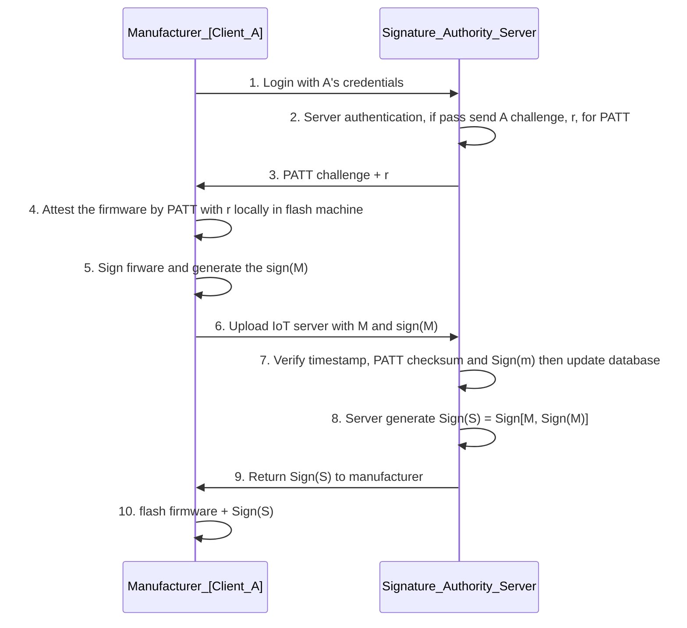

# IOT Supply Chain Protection Case Study: Use Shadow-Box-For-Arm and PATT for Firmware Integrity Assurance 

**Project Design Purpose** : This article will introduce the case study to use the [shadow-box-for-arm](https://github.com/kkamagui/shadow-box-for-arm) to implement the Trusted Execution Environment and use the [PATT: Physics-based Attestation of Control Systems](https://repository.sutd.edu.sg/esploro/outputs/conferenceProceeding/PAtt-Physics-based-Attestation-of-Control-Systems/9911651509846) to implement the Integrity protection pipeline for the IOT firmware during the supply chain. The article will introduce 4 part: 

- Introduction of the People Detection IOT Radar device with PATT algorithm.
- Use Shadow-Box-For-Arm to set up the Trusted Execution Environment to protect data and PATT algorithm. 
- IoT Device Manufacturer Initial Firmware Flashing protection feature.
- IoT Device firmware attestation during usage. 

This case study is a Proof of Concept for IOT Supply Chain Protection, in real production environment, the feature will be more complex.

```python
# Author:      Yuancheng Liu
# Created:     2020/06/29
# Version:     v_0.0.2
# Copyright:   Copyright (c) 2020 Liu Yuancheng
# License:     MIT License
```

**Table of Contents**

[TOC]


------

### 1. Introduction 

The Internet of Things (IoT) is smart embedded devices that have the ability to transfer data over a network without requiring human or computer interaction. The IoT supply chain's diverse and globally distributed nature creates a large attack surface and makes supply chain security a highly complex and challenging problem. For example in this [Drone Firmware Attack and Defense Case Study](https://www.linkedin.com/pulse/ot-cyber-attack-workshop-case-study-05-drone-firmware-yuancheng-liu-giogc), the attacker use the modified firmware to replace the original distance sensors data reading firmware in the mid of the supply chain, then to cause the done crash during people using it. 

#### 1.1 Project Overview

A malicious attacker could insert defect or malware, introduce counterfeit, pirate IP, or launch any malicious attack, at any point in the supply chain. Hence, it is importance to protect the malware integrity of the entire supply chain. In this POC we want to protect the firmware's Integrity from the steps in is flashing in the IoT to the time user start to use it. The system technology stack overview is shown blow: 

- In this project I use the Xandar_People_Detection_Radar(Sensor) and a Raspberry PI to build a reconfigurable IoT device with multiple firmware files. 
- For real time firmware execution attestation, I use the algorithm introduced in paper [PATT: Physics-based Attestation of Control Systems](https://repository.sutd.edu.sg/esploro/outputs/conferenceProceeding/PAtt-Physics-based-Attestation-of-Control-Systems/9911651509846) . 
- For protecting the PATT information and code, I use the [shadow-box-for-arm](https://github.com/kkamagui/shadow-box-for-arm) to build the Arm Trusted Execution Environment
- For Firmware flashing attestation, I create a firmware signal clint running in the manufacturer side and one signature authority server running in the IoT service provider side. 
- For Firmware integrity assurance verification, I create a IoT verification server running in the IoT service provider side to receive the IoT's attestation PATT request connect to the signature authority server to do the IoT authentication.  

#### 1.2 System Work Flow 

**1.2.1 Firmware flashing attestation workflow** 

The Firmware flashing attestation work flow is shown in the below diagram: 



```
Update message : M = ID + version + sensor type + flashing timestamp
Signature : Sign(M) = M + MD5(firmware)
```

