# IoT Supply Chain Protection Case Study : Use Shadow-Box-For-Arm and PATT for Firmware Integrity Assurance

**Project Design Purpose** : This article will introduce a proof-of-concept (POC) case study on securing the IoT firmware supply chain by combining a Trusted Execution Environment (TEE) with physics-based runtime attestation. This experiment demonstrates how to use the [shadow-box-for-arm](https://github.com/kkamagui/shadow-box-for-arm) to establish a lightweight TEE on ARM-based IoT devices, and how integrating the [PATT: Physics-based Attestation of Control Systems](https://repository.sutd.edu.sg/esploro/outputs/conferenceProceeding/PAtt-Physics-based-Attestation-of-Control-Systems/9911651509846) in the IoT firmware to provide continuous firmware integrity assurance.

This article is organized into four key components:

- **IoT Radar Device with PATT Integration** : Introduction of the design of a people-detection IoT radar IoT device and the integration of the PATT algorithm to model and verify the IoT executing firmware. 
- **TEE Deployment Using Shadow-Box-For-Arm** : Implementation of a Trusted Execution Environment to securely isolate sensitive assets of the IoT device, including firmware logic and the PATT attestation mechanism.
- **Secure Firmware Provisioning During Manufacturing** : Design of protection mechanisms during the initial firmware flashing stage to ensure authenticity and prevent unauthorized modification within the supply chain.
- **Runtime IoT Firmware Attestation** : Continuous integrity verification of the deployed firmware using PATT, enabling detection of anomalies or malicious tampering during device operation.

This case study is a Proof of Concept for IOT Supply Chain Protection, in real production environment, the feature will be more complex.

```python
# Author:      Yuancheng Liu
# Created:     2020/06/29
# Version:     v_0.0.2
# Copyright:   Copyright (c) 2020 Liu Yuancheng
# License:     MIT License
```

**Table of Contents**

[TOC]

------

### 1. Introduction 

The Internet of Things (IoT) is smart embedded devices that have the ability to transfer data over a network without requiring human or computer interaction. While IoT technologies enable significant innovation across industries, their highly distributed and multi-stakeholder supply chains introduce substantial security risks. Devices often pass through multiple vendors, manufacturers, and integrators, creating numerous opportunities for adversaries to tamper with hardware or firmware. 

The complexity of the IoT supply chain makes it particularly vulnerable to attacks such as firmware modification, counterfeit component insertion, intellectual property theft, and malicious code injection. A practical example is demonstrated in this [Drone Firmware Attack and Defense Case Study](https://www.linkedin.com/pulse/ot-cyber-attack-workshop-case-study-05-drone-firmware-yuancheng-liu-giogc):

 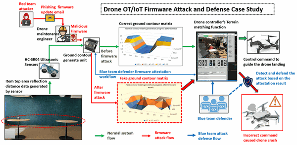

Where an attacker replaced legitimate sensor firmware during transit, ultimately causing system malfunction and device failure during operation.

To address these challenges, ensuring firmware integrity across the entire device lifecycle—from manufacturing to deployment and runtime—is critical. This project presents a proof-of-concept (PoC) system designed to protect IoT firmware integrity by combining secure execution and continuous attestation mechanisms.

The goal of this project is to design and validate an end-to-end protection pipeline that safeguards IoT firmware across both manufacturing and operational phases. By combining secure execution with behavior-based attestation, the proposed approach addresses limitations of traditional static verification methods and enhances resilience against supply chain tampering and runtime compromise. 


------

### 2. Project Overview

In an IoT supply chain, malicious activities can occur at any stage, including firmware development, flashing, distribution, and deployment. Therefore, a robust protection mechanism must ensure both firmware authenticity at provisioning time and integrity verification during runtime.

This project proposes an end-to-end firmware protection framework that spans from initial firmware flashing to real-time device operation. The system integrates hardware-based isolation with physics-based attestation to detect both static and dynamic threats. The project structure diagram is shown below: 

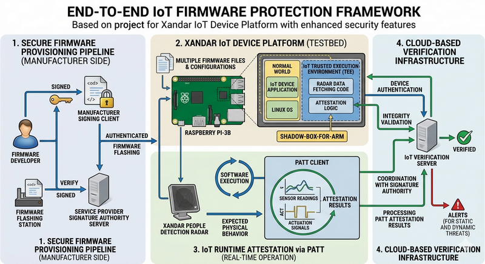

The overall system architecture includes the following key components:

- **Xandar IoT Device Platform** : A reconfigurable IoT testbed built using a [Xandar People Detection Radar](https://xkcorp.com/) sensor integrated with a Raspberry Pi-3B, supporting multiple files firmware execution and configurations.
- **IoT Runtime Attestation via PATT** : Integration of Physics-based Attestation of Control Systems (PATT) client, which validates firmware integrity by correlating software execution with expected physical behavior.
- **IoT Trusted Execution Environment (TEE)** : Deployment of a secure execution environment on Raspberry Pi using shadow-box-for-arm to protect radar sensor data fetching code and attestation logic from tampering.
- **Secure Firmware Provisioning Pipeline** : A manufacturer-side firmware signing client and a service provider–side signature authority server to ensure firmware authenticity during the flashing process.
- **Cloud-Based Verification Infrastructure** : An IoT verification server that performs device authentication and integrity validation by coordinating with the signature authority and processing attestation results.


------

### 3. System Workflow

The system enforces firmware integrity through two main workflows: 

- (1) secure firmware flashing during manufacturing 
- (2) real-time attestation during device operation.

#### 3.1 Firmware Flashing Attestation Workflow

The Firmware flashing attestation work flow is shown in the below diagram: 

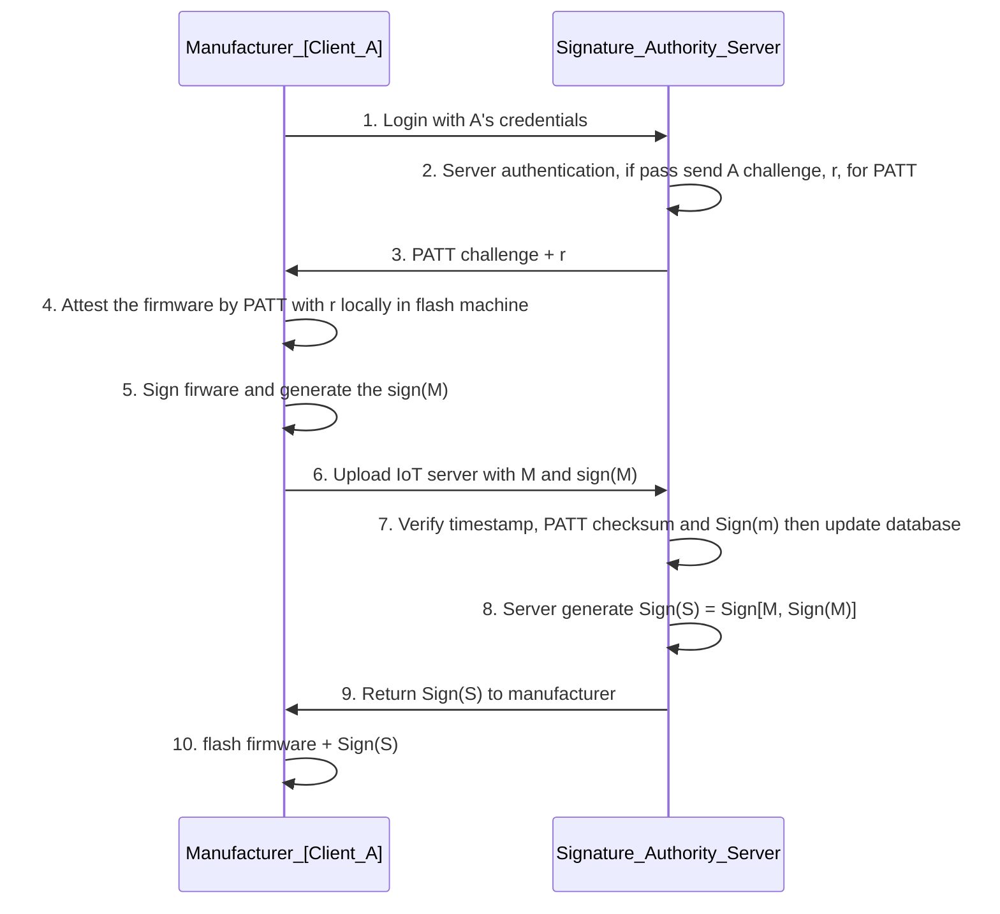

```
Update message : M = ID + version + sensor type + flashing timestamp
Signature : Sign(M) = M + MD5(firmware)
```

During the manufacturing phase, firmware authenticity and integrity are verified before deployment to the IoT device. The process involves a challenge-response mechanism combined with cryptographic signing:

- The manufacturer client authenticates with the signature authority server.
- The server issues a challenge value (*r*) for attestation.
- The firmware is locally verified using the PATT algorithm and signed.
- The signed firmware and metadata (*M*) are uploaded to the server.
- The server validates the submission and generates a secondary signature (*Sign(S)*) to certify the firmware.
- The certified firmware is then securely flashed onto the IoT device.

#### 3.2  IoT Device Real-Time Attestation

The IoT device real time attestation is  shown in the below diagram: 

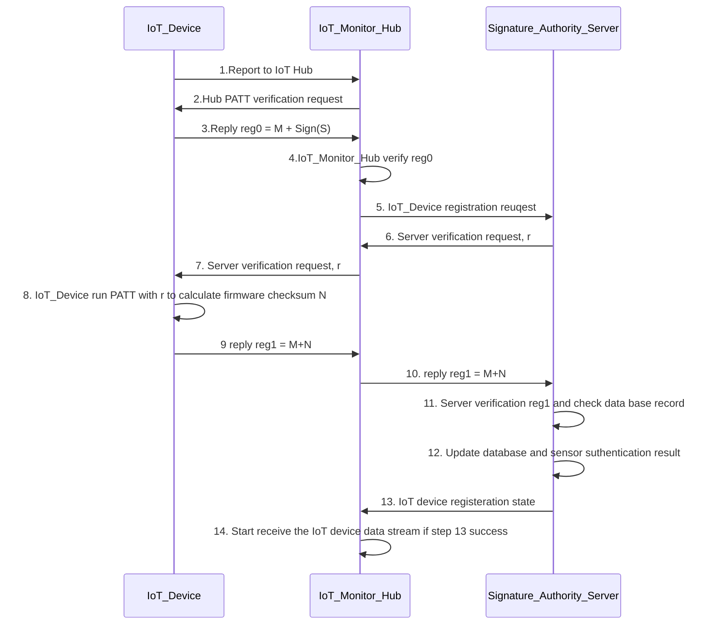

After deployment, the system continuously verifies firmware integrity through runtime attestation:

- The IoT device registers with the monitoring hub and responds to attestation requests.
- The monitoring hub validates stored firmware metadata and communicates with the signature authority server.
- A new challenge (*r*) is issued to the device.
- The device executes the PATT algorithm to compute a runtime checksum (*N*).
- The result is verified against server-side records to confirm firmware integrity.
- Upon successful verification, the device is authorized to transmit operational data.

This runtime verification mechanism enables detection of firmware tampering, unauthorized modifications, or anomalous behavior during operation.


------

### 4. Design of the Xandar IoT Device 

The IoT device is built around a Xandar Kardian people detection radar sensor and a Raspberry Pi-3B to supports real-time sensing and visualization, and also integrates securely with the proposed firmware protection pipeline, including Trusted Execution Environment (TEE) isolation and physics-based attestation. The connection between use a CAT5-USB cable as shown below: 

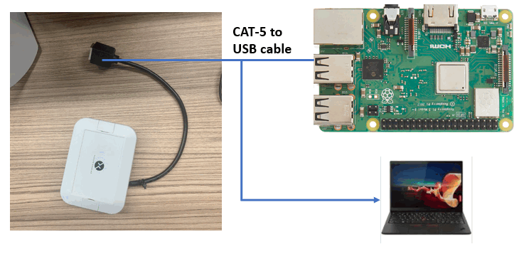

The the Raspberry Pi use its wifi module to connect to the internet. A custom application, referred to as **Xandar Sensor App**, is implemented on the device to collect, process, and visualize sensor data, then connect the the IoT hub server. The application is designed to support both single-sensor and multi-sensor configurations.

#### 4.1 Sensor Data Visualization UI 

This module provides real-time and historical visualization of sensor outputs as shown below:

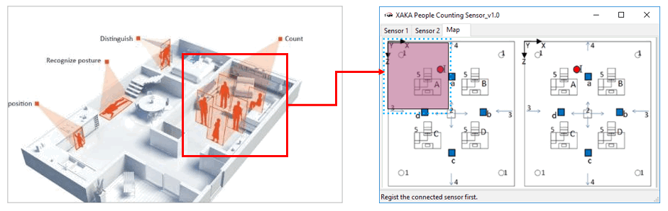

It displays:

- Current detected people count
- Average people count over time
- Normalized people count (post-processed value for stability and accuracy)

Additional features include:

- Display of sensor metadata such as sensor ID, connection interface, and data sequence index
- A pause/resume mechanism to allow inspection of live data streams
- A detailed parameter panel exposing up to 36 sensor-specific parameters for in-depth analysis
- Multi-sensor switching via tab-based navigation

This dashboard plays a critical role in validating both sensor behavior and the consistency of firmware execution, which is later leveraged by the attestation mechanism.

#### 4.2 Top-View Area Monitoring UI

This module provides a spatial visualization of the monitored indoor environment as shown below:

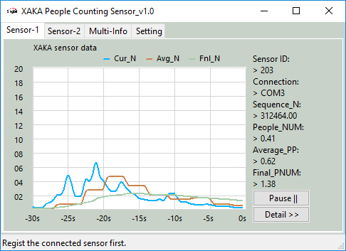

- A **top-view map** displaying sensor placement and coverage
- Real-time visualization of **people density distribution** across the area
- Sensor connectivity status and live data feedback

This view helps correlate physical observations with sensor outputs, which is particularly important for validating the assumptions used in the **PATT (Physics-based Attestation)** model.

#### 4.3 Top-View Area Monitoring Dashboard

This module provides a spatial visualization of the monitored indoor environment as shown below:

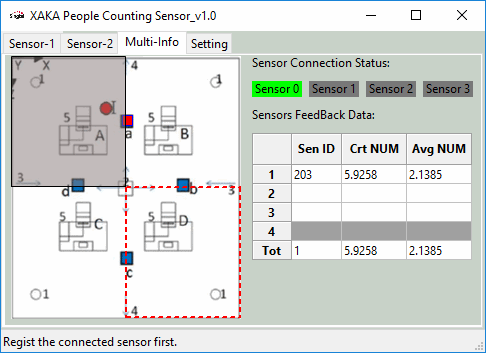

- A **top-view map** displaying sensor placement and coverage
- Real-time visualization of **people density distribution** across the area
- Sensor connectivity status and live data feedback

This view helps correlate physical observations with sensor outputs, which is particularly important for validating the assumptions used in the **PATT (Physics-based Attestation)** model.

#### 4.4 Security Integration Considerations

The IoT device is designed with security as a core requirement:

- Sensitive components, including the PATT algorithm and firmware verification logic, are protected within a Trusted Execution Environment using Shadow-Box-For-Arm
- Firmware integrity is verified both during flashing and at runtime
- Sensor data used for attestation is safeguarded against tampering

By combining sensing, visualization, and security mechanisms within a single platform, this IoT device serves as a practical and extensible testbed for evaluating supply chain protection strategies.


------

### 5. Design of the IoT TrustZone 

The TEE is used to securely store and execute critical components, including the device’s unique identity and PATT attestation credentials.I use the project Trust-Zone/Env (OPTEE) on Raspberry PI I developed : https://github.com/LiuYuancheng/Raspberry_PI_OPTEE and the https://github.com/kkamagui/shadow-box-for-arm project to implement the Trusted Execution Environment to protect the Unique ID and PATT credential files. the work flow is shown below: 

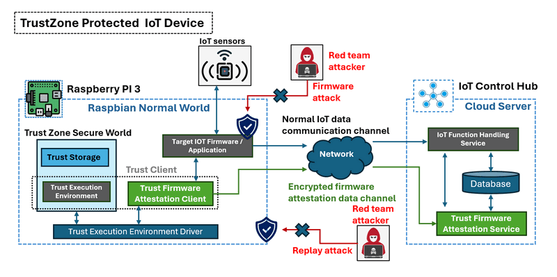

#### 5.1 Additional steps setup shadow-box

The Shadow-Box environment is deployed by following the “Build Shadow-Box for ARM and Make Secure Pi with Raspberry Pi 3” procedure from the official repository. However, several additional adjustments are required to ensure proper functionality on a Raspberry Pi 3 Model B.

**5.1.1 Root Filesystem and Boot Image Synchronization**

During the step *“**3.5.1** Copy OP-TEE OS with Shadow-Box for ARM and New Linux Kernel to Raspbian OS”*, it is critical to ensure that the required image files are correctly copied into both the `boot` and `boot1` directories as shown below:

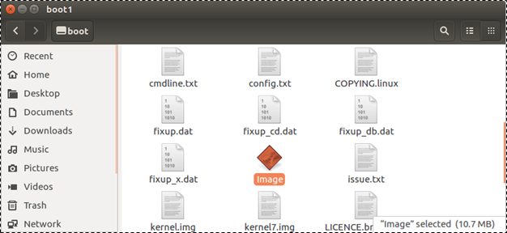

In addition, the root filesystem must be extracted into the `boot1` directory using:

```
sudo gunzip -cd $HOME/shadow-box/gen_rootfs/filesystem.cpio.gz | sudo cpio -iudmv "boot1/*"
```

Also verify that the kernel module directory: `/rootfs/lib/modules/4.6.3-17586g76cacae` exists on the Raspberry Pi SD card. This specific kernel version is required for compatibility with Shadow-Box as shown below:

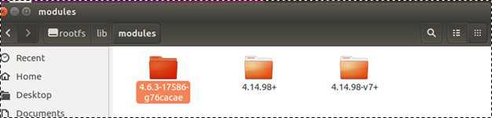

**5.1.2 shadow_box_client Binary Validation**

During activation (step: 3.6.5. Activate Shadow-Box for ARM and  Start Secure Pi), running:

```
sudo shadow_box_client -g
```

may produce no output if the client binary is incorrectly deployed.

To troubleshoot:

- Check `/bin/shadow_box_client` file size
- If the size is abnormally small (e.g., ~1KB), the binary is corrupted or empty

Fix step as shown below:

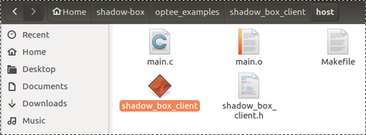

- Rebuild the binary from the Shadow-Box project directory:

  ```
  shadow-box/optee_examples_shadow_box_client/host
  ```

- Run `make` if the executable is missing

- Copy the rebuilt binary to the Raspberry Pi:

  ```
  /bin/shadow_box_client
  ```

After copying, sign the binary using:

```
sudo ./img_sign.sh /bin/shadow_box_client
```

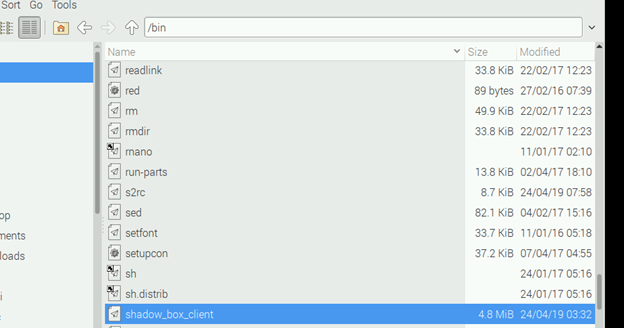

**5.1.3 Kernel Version Verification**

Before enabling Shadow-Box protection:

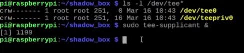

```
sudo shadow_box_client -s
```

Ensure that the system is running the correct kernel version:

```
sudo uname -r
```

The output must match:

```
4.6.3-17586g76cacae
```

Any mismatch (e.g., newer kernels like 4.17+) may cause Shadow-Box to fail.

**5.1.4 Execution Path Requirement**

When executing Shadow-Box client in section 3.6.6. Check Your Secure Pi Remotely  commands such as:

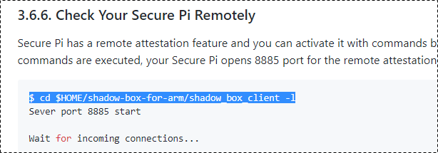

```
sudo shadow_box_client -l
```

it is necessary to first navigate to the Shadow-Box project directory:

```
cd $HOME/shadow-box-for-arm
```

Failing to do so may result in execution errors due to missing relative paths or dependencies.


------

